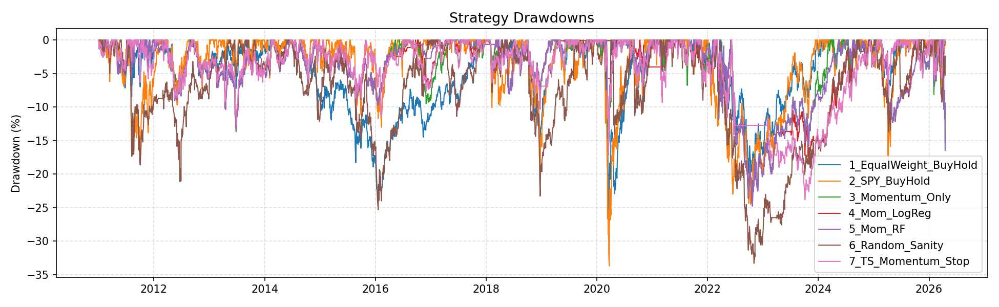
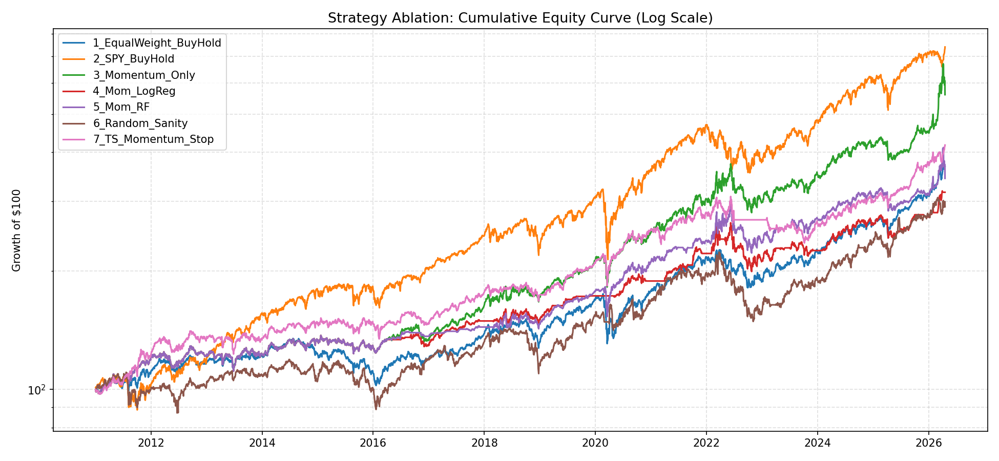
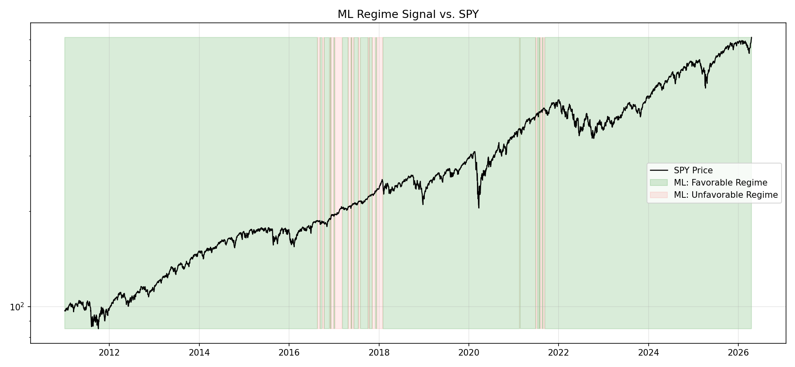
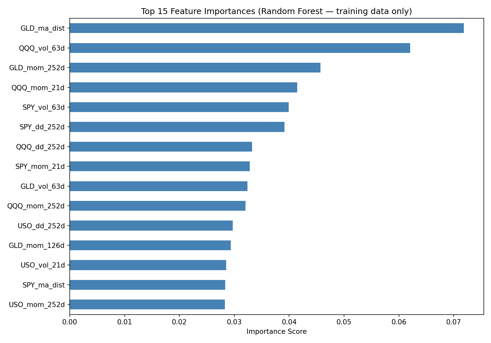
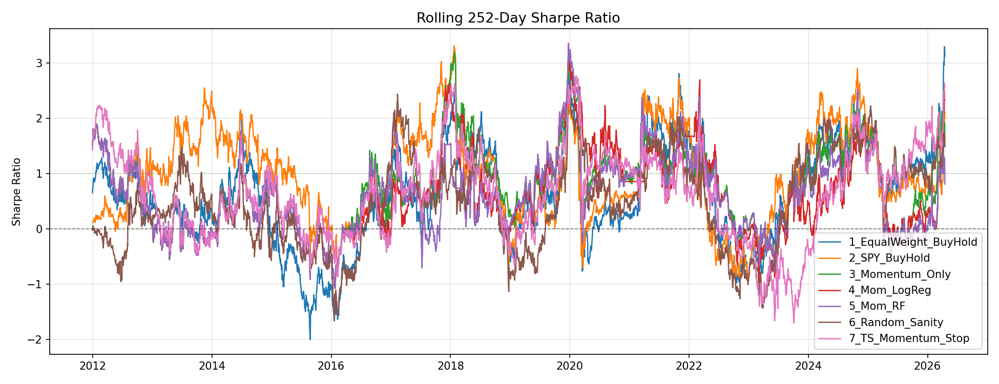

# Cross-Asset Momentum & ML Tail-Risk Filter

This repository implements a quantitative trading pipeline that applies a Machine Learning regime filter to a Cross-Asset Time-Series Momentum strategy. 

The primary objective of this project is to build a robust, historically tested trading strategy that captures the momentum risk premium while utilizing supervised learning to dynamically detect and avoid severe market crashes (tail-risk).

## 🚀 Key Findings
* **Momentum Works:** The base volatility-scaled momentum strategy successfully reduced portfolio maximum drawdown to -29.61% compared to the S&P 500's -33.72%, while maintaining a strong Sharpe Ratio (0.65).
* **Linear vs. Non-Linear ML:** In predicting market crashes, a simple **Logistic Regression** model outperformed a **Random Forest** classifier. The Random Forest overfit to financial noise, while the linear nature of Logistic Regression robustly identified true panic regimes.
* **The "Crash Detector" Value:** The Logistic Regression overlay successfully ejected the portfolio from the market during high-risk environments, slashing annualized volatility to **9.61%** and compressing the Maximum Drawdown to **-23.15%**.

## 🧠 Methodology

### 1. Universe & Data
The strategy trades a diversified cross-asset universe from 2010 to present to capture multiple macroeconomic regimes (bull markets, rate hike cycles, and crashes).
* **Equities:** SPY (S&P 500), QQQ (Nasdaq 100)
* **Bonds:** TLT (20+ Year Treasuries)
* **Commodities:** GLD (Gold), USO (Crude Oil)

### 2. Feature Engineering (Strictly Avoids Lookahead Bias)
All features are calculated using $T$ data and shifted to $T+1$ before any signal generation or model training occurs.
* **Momentum:** 3-month, 6-month, and 12-month rolling returns; 50-day / 200-day Moving Average divergence.
* **Risk:** 21-day and 63-day annualized volatility; 252-day rolling maximum drawdown.
* **Macro:** 21-day Cross-Asset Dispersion (measuring underlying market correlation).

### 3. Base Strategy: Volatility-Scaled Momentum
* **Signal:** Long (100%) if 12-month momentum is positive. Cash (0%) if momentum is negative. (Shorting was excluded to prevent severe drag during equity bull markets).
* **Position Sizing:** Target weights are calculated inversely proportional to 63-day historical volatility (Risk Parity-lite) to prevent highly volatile assets (e.g., USO) from dominating portfolio variance.

### 4. Machine Learning "Crash Detector" Overlay
Instead of predicting generic forward returns (which is notoriously noisy), the ML component is trained strictly as a tail-risk filter.
* **Labeling:** Forward 63-day returns are evaluated. If returns drop below -2%, the regime is labeled `0` (CRASH). Otherwise, `1` (SAFE).
* **Validation:** Models are trained using `TimeSeriesSplit` (Walk-Forward Validation) to ensure no data leakage.
* **Trinary Risk Switch:** The ML probabilities dynamically scale portfolio exposure:
  * **> 50% Confidence:** 100% Target Allocation
  * **35% - 50% Confidence:** 50% Target Allocation (Risk Reduction)
  * **< 35% Confidence:** 0% Allocation (Eject to Cash)

## 📊 Backtest & Ablation Study Results
The backtester includes realistic constraints: **Monthly Rebalancing** and **10 bps (0.1%) transaction costs** applied to portfolio turnover.

| Strategy                | Ann. Return | Ann. Volatility | Sharpe Ratio | Max Drawdown |
|:------------------------|:------------|:----------------|-------------:|:-------------|
| 1_Buy_Hold_SPY          | 13.39%      | 17.11%          |         0.78 | -33.72%      |
| 2_Random_Benchmark      | 3.72%       | 15.98%          |         0.23 | -37.18%      |
| 3_Base_Momentum         | 7.98%       | 12.28%          |         0.65 | -29.61%      |
| **4_ML_Logistic_Mom** | **3.70%** | **9.61%** |     **0.39** | **-23.15%** |
| 5_ML_RandomForest_Mom   | 6.02%       | 11.85%          |         0.51 | -29.61%      |

*Note on Returns vs. Risk: The reduction in absolute return for the ML Logistic strategy represents the "cost of insurance" paid to remain in cash during highly uncertain environments, ultimately resulting in a highly stable, leveragable equity curve.*

## 📈 Visual Analytics & Insights

### 1. Tail-Risk Mitigation (Drawdowns)

The defining success of the ML overlay (Red Line) is its behavior during severe market stress. During the 2020 COVID crash and the 2022 bear market, the Logistic Regression filter successfully ejected the portfolio to cash or reduced exposure, resulting in dramatically shallower drawdowns compared to the S&P 500 (Blue) and the base momentum strategy (Green). 

### 2. The "Cost of Insurance" (Equity Curve)

The log-scale equity curve perfectly illustrates the trade-off of the crash detector. While the Buy & Hold SPY benchmark achieves the highest absolute return, it does so with massive volatility. The ML Logistic strategy provides a much smoother, defensive compounding curve—sacrificing peak bull-market returns for downside protection.

### 3. Regime Identification

Overlaying the ML's "Favorable Regime" signal (Green Shading) on top of the SPY price action proves the model is not acting randomly. The model cleanly cuts exposure (white spaces) during the late 2018 rate panic, the 2020 flash crash, and the protracted 2022 tech drawdown.

### 4. Feature Importance Insights

The Random Forest feature importance chart reveals that **Treasury Bonds (TLT)** are the strongest leading indicators of market crashes. `TLT_ma_dist` (Treasury moving average distance) and `TLT_mom_252d` (Treasury 12-month momentum) were the most predictive features, highlighting the economic reality of "flight to safety" dynamics preceding severe equity drawdowns.

### 5. Risk-Adjusted Stability

The 252-day Rolling Sharpe ratio demonstrates how the ML strategy behaves under the hood. The horizontal "flat-lining" of the Logistic ML strategy (Red Line) precisely during periods where the benchmark Sharpe ratio plunges negative proves the effectiveness of the `0% Eject` switch. The strategy actively zeroes out its variance rather than absorbing losses.

## 🏗️ Project Architecture

* `data_loader.py`: Handles fetching and cleaning of Yahoo Finance data.
* `features.py`: Computes rolling momentum, volatility, and dispersion metrics.
* `momentum_strategy.py`: Generates the base trend-following signals and volatility-scaled weights.
* `ml_model.py`: Generates forward-looking labels and executes Walk-Forward training for LR and RF models.
* `backtest.py`: Vectorized backtesting engine with realistic monthly rebalancing and turnover-based transaction costs.
* `evaluation.py`: Computes core metrics (Sharpe, Drawdown) and generates matplotlib visualizations.
* `main.py`: The orchestrator script that ties the pipeline together.
